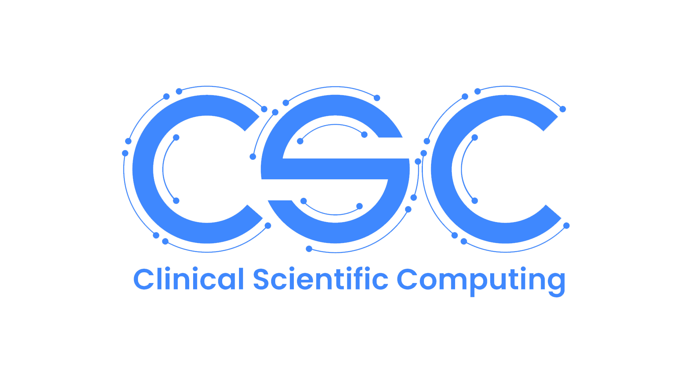

# Data Checking

This SOP describes how to check data to ensure adequate anonymisation has taken place before images can be used for research
and service improvement and evaluation processes.

[View Repo](https://github.com/GSTT-CSC/XNAT) . [Report Error](https://github.com/GSTT-CSC/XNAT/issues) . [Request Feature](https://github.com/GSTT-CSC/XNAT/issues) . [Request Document](https://github.com/GSTT-CSC/XNAT/issues)

<!-- TABLE OF CONTENTS -->

  
<h2 style="display: inline-block">Table of Contents</h2>

  <ol>
    <li>
      <a href="#data-checking">Data Checking</a>
      <ul>
        <li><a href="#PII">PII</a></li>
      </ul>
    </li>
    <li><a href="#DICOM-tags">DICOM Tags</a>
    <li>
      <a href="#Burnt-in-data">Burnt-in data</a>
      <ul>
        <li><a href="#Ultrasounds">Ultrasounds</a></li>
        <li><a href="#Patient-Protocols-and-Dose-Reports">Patient Protocols and Dose Reports</a></li>
        <li><a href="#Screenshots">Screenshots</a></li>
        <li><a href="#Annotations">Annotations</a></li>
        <li><a href="#Miscellaneous">Miscellaneous</a></li>
      </ul>
    </li>
    <li><a href="#high-definition-faces">High definition faces</a></li>
    <li><a href="#project-contents">Project contents</a></li>
    <li><a href="#resources">Resources</a></li>
    <li><a href="#roadmap">Roadmap</a></li>
    <li><a href="#contributing">Contributing</a></li>
    <li><a href="#contact">Contact</a></li>
   <li><a href="#acknowledgements">Acknowledgements</a></li>
  </ol>

<!-- DATA CHECKING -->
## Data Checking

<!-- PII -->
### PII

Personal identifiable information (PII) is any information that can directly or indirectly identify an individual from
their data. Examples of directly identifiable data are first and last name, date of birth, or a home address. Examples of 
indirectly identifiable data are date of scan, diagnosis, first half of postcode. 

All PII from medical images must be removed before the images can be used for research. This protects the identity of the individuals 
imaged and it is our legal and moral duty to our service users not to divulge their personal data nor abuse our access to it.
The anonymisation must therefore be sufficient to achieve the goal of separating the individual from their data in a manner which ensures
no link can be re-established between the two. 

National Data Opt Out (NDOO) further ensures that service users have a right to withdraw their consent to any of their medical data being
used for research or service development. Their data must therefore be excluded. For more details on this speak to Haleema or Dika. 

<!-- DICOM TAGS -->
## DICOM Tags

DICOM is a data format and a networking protocol used in medical imaging. Each DICOM file holds information on the person in the image (PII) and
information about the scan itself (e.g. equipment, imaging protocol, time and date of scan), and the information which forms the image (a set of pixel
data and a decoder of the pixel data). The data are contained in DICOM tags. Each tag is labelled (e.g. (0008,0010)) by what data it represents. This
allows for integration across systems and ensures data can be filtered, found, and communicated between hospitals. 

The DICOM tags contain direct and indirect PII and therefore must be manipulated to achieve our goal of separating the individual from the data. In XNAT
we do this using a script, written in DicomEdit, which outlines all DICOM tags which need to be removed (e.g. patient name) or changed to mask the true data (e.g. 
dates are shifted by a fixed number of days). However, manufacturers frequently add additional data in some tags (called Private Tags) and not all modalities 
use the same tags (for example: a nuclear medicine DICOM file will contain information on the radiopharmaceutical used and the activity injected, which an X-ray will not,
and similarly a CT scan will have details on radiation beam used to acquire the image while an MRI will hold data on pulse sequence used). This means that 
for some data the script we use is not optimised. Because of this, DICOM tags must be checked on a representative subset of data before the total set is ingested.

To do this, first ingest a few scans (I recommend around 3 per modality) into XNAT and check the DICOM tags. To do this, open the project to 
which you archive the data, then open the subject, then open the experiment you wish to check. Hover your mouse just right of the scan number (middle of the page where
all scans are listed in a numbered order). 3 icons will appear, select the 'view details', then 'view DICOM headers. A window will open 
and you'll see all the DICOM tags pertaining to that scan. Look through them and pay careful attention to presence of dates, names, postcodes, accession numbers and patient IDs.
The dates should be delayed by a few days from what the scan was originally but they should be consistent across the whole header. There should be no names, no postcodes, and no accession numbers
remaining in the header.

Once you have confirmed that the anonyisation script was adequate for your project, you can ingest the rest of the data. If you find errors, you need to amend
the script and try again. If you need help with this, please speak to Dika or Haleema.

<!-- BURNT-IN DATA -->
## Burnt-in data

Burnt-in data are PII data which are part of the actual image. They are especially common in ultrasounds, but also in CT's patient protocols and dose reports.
Annotations are also common and may also constitute PII. 

<!-- ULTRASOUNDS -->
### Ultrasounds

All ultrasounds data have burnt-in data which needs to be removed. If you have only static images, you can use pixelcleaning.py script for banner removal.
If you have cine images as well (which is usually the case), you'll need to decompress them first, then run the python script, then recompress. Please follow the SOP-iFIND!

<!-- Patient Protocols and Dose Reports -->
### Patient Protocols and Dose Reports

Patient protocols and dose reports should not be ingested or should not be forwarded externally. You can filter them out at ingestion into XNAT or at 
the downloading stage. If you do need them, for removal of burnt-in data, you will need to use pixelcleaning.py 
script and deid pydicom package. This is described in SOP-iFIND and should work on all burnt-in data but as always - check first!

<!-- SCREENSHOTS -->
### Screenshots

Screenshots and screengrabs frequently contain PHI, especially in modalities such as PET and nuclear medicine. Check whether these are actually needed 
for your project and if not filter them out in the same way you filter out dose reports and patient protocols. If you do need them, you can either
manually remove the PHI using any image processor or a Python script to crop the PHI out of the shot.

<!-- Annotations -->
### Annotations

Annotations may also contain PHI - but not always. If your dataset is annotated, please speak to the project owner and whoever annotated the images
to find out if the data is or is not PHI. Annotations are frequently added as overlays and may be 'turned off', but if they are merged with the DICOM, the removal
task may be more complex. In cases where the annotations are merged with DICOM, annotation-free DICOMs should also exist: ensure you only ingest or download those. 

<!-- Miscellaneous -->
### Miscellaneous

Sometimes other data may also be found - pdfs, PACS fragments you can't open, occasional note named after the patient, and the DICOM tags may
sometimes (rarely) contain entire clinical reports. It's important to spot check for these in your dataset, but it is not realistic to check each scan 
individually. If you see anything that doesn't look like it belongs in the imaging session, delete it; and pay attention when downloading data where the series
names are listed and ensure you don't download anything that contains PHI.

<!-- HIGH DEFINITION FACES -->
## High-definition Faces

Only head MRIs are considered to have sufficient resolution for face rendering (and what's more identifiable than a face?), so you don't 
have to worry about head CTs. All high definition face images must be post-processed with facemasking. To learn how to do this, please 
have a look at the Facemasking SOP.

<!-- PROJECT CONTENTS -->
## Project Contents

There are two ways to check the contents of your project, depending on what you need. 

To count sessions open your project in XNAT and in the right hand corner of the section 'Subjects' there are two buttons: 
'Reload' and 'Options'. Click 'Options' and select 'Spreadsheet'. This will download a spreadsheet with a list of all subjects and the number of sessions held for each subject.

To get a list of all session names contained in the project, write the following into your browser:

``https://sp-pr-flipml01.gstt.local/REST/projects/PROJECT NAME/experiments``

substituting PROJECT NAME with the ID of your project (found on the landing page of your project in the Details section under ID:).
This will open a html site of all experiments contained in the project. Copy the contents into a text file, save it, then open it in Excel. 
Text Import Wizard will appear - select Delimited, click Next, then put a tick in the Tab checkbox and click Finish. You should get an easy-to-use spreadsheet
of sessions contained, the date of each session and the upload date.

<!-- RESOURCES -->
## Resources
* [XNAT](https://www.xnat.org/)
* [DICOM Standards Supplements](https://www.dicomstandard.org/supplements)

<!-- ROADMAP -->
## Roadmap
See the [open issues](https://github.com/GSTT-CSC/XNAT/issues) for a list of proposed features (and known issues).

<!-- CONTRIBUTING -->
## Contributing

<!-- CONTACT -->
## Contact

* [Dika Vilic](mailto:Dijana.Vilic@gstt.nhs.uk) ([GSTT-CSC](https://gstt-csc.github.io/))
* [Haleema Al Jazzaf](mailto:Haleema.AlJazzaf@gstt.nhs.uk) ([GSTT-CSC](https://gstt-csc.github.io/))
* [Project Link](https://github.com/GSTT-CSC/XNAT)

<!-- ACKNOWLEDGEMENTS -->
## Acknowledgements

* [README template by othneildrew](https://github.com/othneildrew/Best-README-Template)
* [Neuroinformatics Research Group at Washington University](https://www.mir.wustl.edu/research/research-centers/computational-imaging-research-center-circ/labs/marcus-lab)
