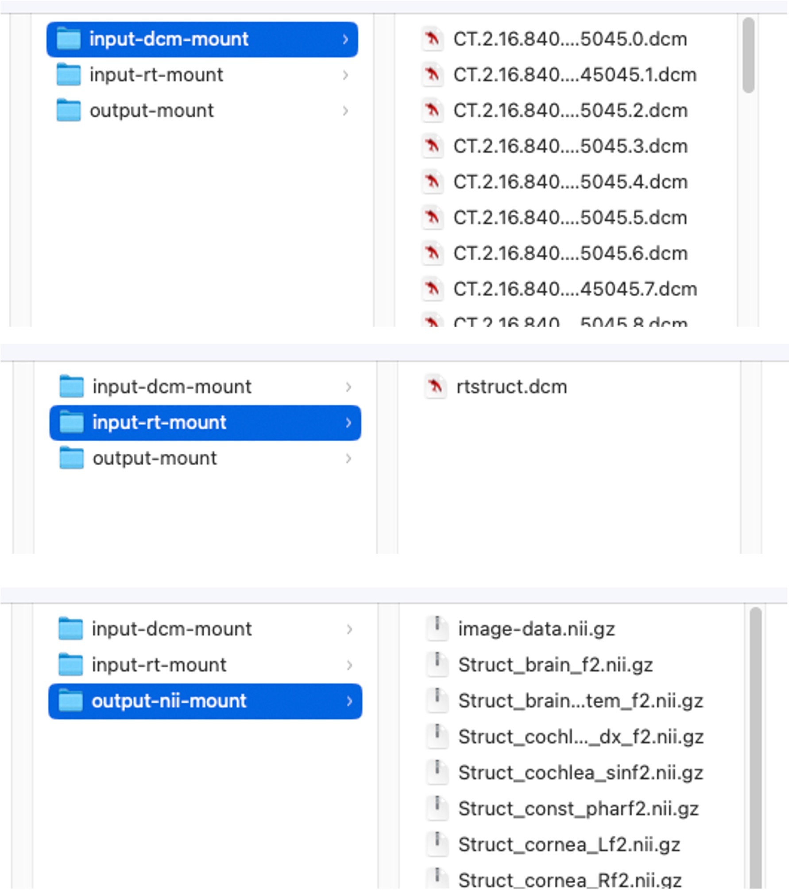

# RTSTRUCT to NIfTI XNAT Container Service plugin

## Overview

This is a developer guide for editing and using the GSTT-CSC RTSTRUCT to NIfTI XNAT Container Service plugin – rt2nii, for short. 

rt2nii enables the user to convert StructureSets within an RTSTRUCT file into individual .nii.gz files. For example, if you point rt2nii at `rtstruct.dcm` which containers StructureSets called "Heart", "Lungs" and "Liver", it will output `Heart.nii.gz`, `Lungs.nii.gz` and `Liver.nii.gz`.

The plugin is built according to the [XNAT Container Service plugin framework](https://wiki.xnat.org/container-service/).

## Clone & Use or Test rt2nii

This plugin can be run locally, outside of XNAT, which might be useful for updating the plugin, local testing, etc.

Clone this repo and enter the rt2nii plugin directory:

```shell
git clone https://github.com/GSTT-CSC/XNAT.git
cd XNAT/csc_xnat/rt2nii-plugin
```

Build the Docker container:

```shell
docker build -t xnat-rt2nii .
```

For testing, you will need some test data, such as in the following directory structure:
    
    rt2nii-test-data/
    ├── input-dcm-mount
        │── dicom-image-slice-1.dcm
        │── dicom-image-slice-2.dcm
        │── dicom-image-slice-3.dcm
        │── .
        │── .
        │── dicom-image-slice-N.dcm
    ├── input-rt-mount
        │── rtstruct.dcm
    ├── output-nii-mount
        │── <empty - .nii.gz will output here>

Once you have this, you can test the plugin with the following command:

```shell
docker run -v /path/to/rt2nii-test-data/:/opt xnat-rt2nii input-dcm-mount input-rt-mount output-nii-mount image-data.nii.gz
```

By default, in the `output-nii-mount` directory you should see `image-data.nii.gz` and one contour `.nii.gz` per StructureSet within `rtstruct.dcm`.

Note: if you omit the fourth argument ("image-data.nii.gz") on a the command above, the plugin will ONLY return the contours as NIfTI files without the image data.

Here is an example of the input and output files:




## Install rt2nii in XNAT

To use rt2nii in XNAT, push the container to a **public** Docker container library (e.g. DockerHub, GHCR, etc.):

```shell
docker image tag xnat-rt2nii ghcr.io/gstt-csc/xnat:rt2nii-plugin-latest
docker push ghcr.io/gstt-csc/xnat:rt2nii-plugin-latest
```

Next, install the plugin in XNAT via the Administer tab. For guidance, [follow the official XNAT instructions](https://wiki.xnat.org/container-service/container-development-quickstart-guide#ContainerDevelopmentQuickstartGuide-InstallingandRunning).

Once installed, import your test dataset into XNAT and run the plugin to test it works.


## Notes on Editing this Plugin

The `command.json` file is responsible for telling XNAT how it should interact with your Docker container (see [XNAT documentation here](https://wiki.xnat.org/container-service/container-development-quickstart-guide#ContainerDevelopmentQuickstartGuide-CommandDefinition)). For example, it determines whether the plugin should operate at the Session level or Scan level in XNAT, and many other things.

If you edit `command.json`, you need to then run `command2label.py` (provided by the XNAT developers), which generates the final "LABEL" line of the Dockerfile. Literally, copy-paste the output of `command2label.py` into the last line of the Dockerfile.