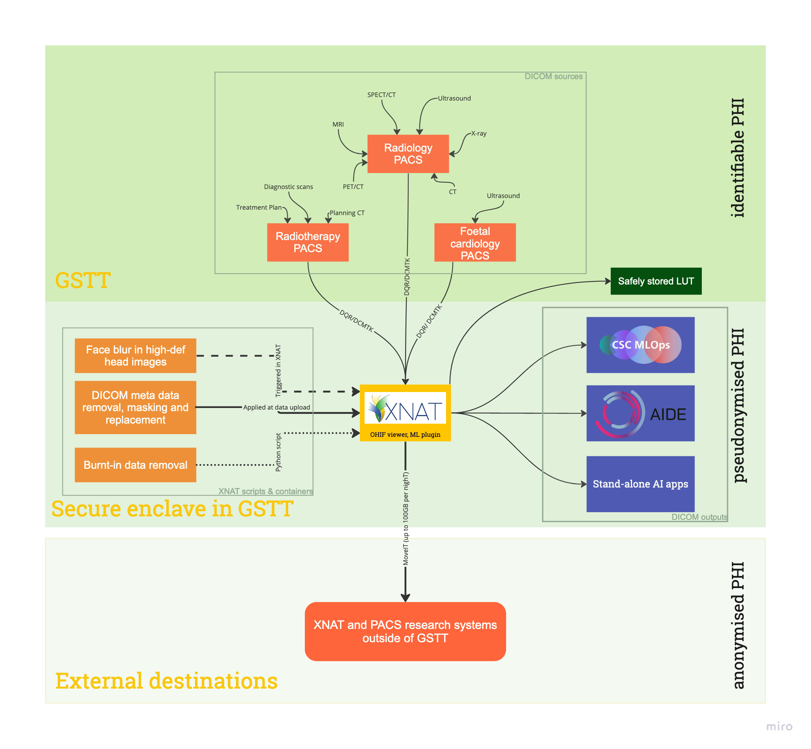

# XNAT

[View Repo](https://github.com/GSTT-CSC/XNAT) . [Report Error](https://github.com/GSTT-CSC/XNAT/issues) . [Request Feature](https://github.com/GSTT-CSC/XNAT/issues) . [Request Document](https://github.com/GSTT-CSC/XNAT/issues)

<!-- TABLE OF CONTENTS -->

  
<h2 style="display: inline-block">Table of Contents</h2>

  <ol>
    <li>
      <a href="#about-the-project">About The Project</a>
      <ul>
        <li><a href="#tools">Tools</a></li>
      </ul>
    </li>
    <li>
      <a href="#getting-started">Getting Started</a>
    </li>
    <li>
        <a href="#overview">Overview</a>
        <ul>
          <li><a href="#data-collection">Data collection</a></li>
          <li><a href="#anonymisation">Anonymisation</a></li>
        </ul>
    </li>
    <li><a href="#resources">Resources</a></li>
    <li><a href="#roadmap">Roadmap</a></li>
    <li><a href="#contributing">Contributing</a></li>
    <li><a href="#contact">Contact</a></li>
   <li><a href="#acknowledgements">Acknowledgements</a></li>
  </ol>

<!-- ABOUT THE PROJECT -->
## About The Project

This project aims to track general documentation, standard operating procedures (SOP) and helper scripts for XNAT. 

### Tools
* [XNAT](https://xnat.org/) Imaging informatics platform which can be used to support a wide range of imaging-based projects
* [Grassroots DICOM (GDCM)](https://gdcm.sourceforge.net/) C++ library for DICOM and ACR-NEMA medical images, which is automatically wrapped to Python, C#, Java and PHP (using [SWIG](https://www.swig.org/))
* [Midnight Commander](https://midnight-commander.org/) Visual file manager, which is licensed under GNU General Public License
* [PuTTY](https://www.putty.org/) Terminal emulator, serial console and network file transfer application, which supports several network protocols, including SCP, SSH, Telnet, rlogin, and raw socket connection
* [WinSCP](https://winscp.net/eng/download.php) Free SFTP, SCP, S3 and FTP client for Windows
  * If you are working on a remote environment that requires elevated privileges to install 3rd party software, download the [portable executable version](https://winscp.net/eng/downloads.php). 

<!-- GETTING STARTED -->
## Getting Started
Contact [Dika](mailto:Dijana.Vilic@gstt.nhs.uk) for access to XNAT.

<!-- OVERVIEW -->
## Overview
XNAT is an platform capable of storing and managing medical images and associated data. Within Guy’s and St Thomas’ NHS Foundation Trust (GSTT), it forms a part of the local secure enclave for the purpose of federated learning in artificial intelligence projects. The data is ingested from PACS into XNAT where it is anonymised and sorted into relevant projects, ensuring data is only visible to those who need it, and allowing for data deletion upon project completion. The following describes the process of data collection, anonymisation (or more accurately, *de-identification*) and data storage in XNAT, as well as how compliance with [DICOM Standards Supplement 142](https://www.dicomstandard.org/News-dir/ftsup/docs/sups/sup142.pdf) is achieved.

Medical imaging data is typically stored in a DICOM format. DICOM stands for *Digital Imaging and Communications in Medicine* and is an international standard format for medical image storage, retrieval, processing and transfer. DICOM images consist of the actual acquired image as a set of pixels and a DICOM header. Data coded within the DICOM header are a series of attributes describing the scan and patient. Each attribute is tagged with a unique DICOM tag which consists of a group and element number, and each tag has a name to identify the type of information (or attribute) contained within the tag. This principle of data tagging allows DICOMs to be compared, transferred, stored and queried.

Before any medical data can be used in research or for training of artificial intelligence (AI) algorithms, it must first be completely anonymised/de-identified such that no data used can be traced back to any individual. To do this, the DICOM tags need to be altered, deleted or manipulated in such a way that the image no longer describes the individual. However, because there are many DICOM tags within a DICOM header and since what is and what is not identifiable information is not always straightforward, a [DICOM Standards Supplement 142](https://www.dicomstandard.org/News-dir/ftsup/docs/sups/sup142.pdf) was created. This outlines best de-identification practices for purposes of clinical trials, and we have adopted this same standard for our de-identification approach.

De-identification in XNAT is done at 2 levels; firstly, when data arrives into XNAT from PACS (site-wide de-identification) and secondly, when data is moved from the Pre-Archive into the assigned project (project-level de-identification).

### Data collection
Data can be ingested into XNAT via two routes:

* Pushed from PACS via teleradiology
* Pulled from within XNAT using query-retrieve (Q/R)

Teleradiology is used for sending individual DICOM objects to XNAT. The sender must have access to and the necessary permissions to send from Sectra PACS (managed by the PACS team) to the *GSTT_XNAT* destination.

Q/R is used for importing batches of data. The data required can be manually searched by accession number, patient name, patient ID or the date range. Alternatively, the data can be requested by uploading a CSV file. The instructions on how to format the CSV file can be found [here](https://wiki.xnat.org/xnat-tools/dicom-query-retrieve-plugin/using-dqr-bulk-querying-and-importing-via-csv-file).

<!-- DATA COLLECTION -->
#### Data collection process
> Before you start make yourself a cup of tea or get a snack, put on some soothing music or a podcast in the background. XNAT is slow and you will need to be patient with it else you will keep cancelling your own commands. Pop-ups can be slow and the amount of data moved takes much time. I recommend you start this at the end of the day instead of at the beginning and leave it to go over night to account for higher bandwidth demands on PACS during office hours.

1. Log into the GSTT network and open Chrome (it won't work well on Edge and it hasn't been tested on Mozilla).
2. Go to https://sp-pr-flipml01.gstt.local and log in with your username. If you do not have a username, contact [Dika](mailto:Dijana.Vilic@gstt.nhs.uk) to make one for you.
3. If the project does not exist yet, contact [Dika](mailto:Dijana.Vilic@gstt.nhs.uk) to create it. If you have any specific de-identification requirements, please also let her know about them.
4. To open your project page, click on *Browse - My Projects* and select the project you are working with and this will open your project page. 
   * If you have a small number of scans to upload (<100), click on *Import From PACS* on the right-hand side. 
   * If you have a large cohort, we recommended using the REST API to perform the upload and so please speak to [Dika](mailto:Dijana.Vilic@gstt.nhs.uk) about this process.
5. If your dataset is reasonably small, use the data Q/R (DQR) route. Clicking on *Import from PACS* will open the DQR page which will allow you to query Sectra PACS for the requested images. You can use the DQR in two ways: 
   * By entering the search criteria
   * By importing a CSV file

##### Entering the search criteria
You can use accession number or patient ID, date range, `*` for wildcard. 
1. Click on *Search PACS* and wait for the results to show. 
2. Once you find the correct scan(s), select these by ticking the checkbox on the left-hand side. 
3. Click on the *Begin Import* button at the bottom of the screen. A pop-up will appear to select all series which are relevant. **If you’re importing CTs, de-select the *Dose Info*, *Dose Report* and the *Patient Protocol* series, as they contain burnt-in patient data!**
4. Click *Import*.

##### Importing a CSV file
1. Upload a [**correctly-formatted** CSV file](https://wiki.xnat.org/xnat-tools/dicom-query-retrieve-plugin/using-dqr-bulk-querying-and-importing-via-CSV-file) to perform a bulk search. The CSV file should contain either the unique accession numbers or a patient ID, and a study date (which should be `YYYYMMDD` to match the date formatting in PACS). 
2. Click *Import CSV* at the top of the page, select your CSV file and click on *Upload*. The query will then begin, but please note it may take a while to complete. If an error occurs, test your CSV file by reducing it to only one query and see if that comes up with what you expect. 
3. Once your query returns all your requested scans without issue, select which scans to import. **XNAT can only handle about 20-30 import queries at once, else it will get stuck on the *Retrieving series information* screen. **If you’re importing CTs, de-select the *Dose Info*, *Dose Report* and the *Patient Protocol* series, as they contain burnt-in patient data!**
4. Wait until you get a notification that the query had been sent to PACS. 
5. Click on *Close*. **You will need to upload the CSV again to select the next batch for import**.

After following either of the above two data retrieval methods, you will need to:      
1. Click on *Upload - Go to prearchive* to see the imported data. 
2. Click *Refresh* if your data does not appear, or click on *Upload - Import Queue/History* as the data may take a while to transfer.
3. In the Pre-archive, you can review the details of your import, such as files and DICOM tags. Once you have confirmed you are happy with the data, select it in the Pre-archive by ticking the left-hand side checkbox.
4. Click on *Change projects* on the right-hand side and select your project. This will assign the data to your project, and you can then click to *Archive* it. This will move the data from the Pre-archive into your project folder.
5. You can now view, amend and interact with the data in the project *Browse - My Projects - your project folder*. You can check the DICOM tags of each data session by clicking on the *Subject* and hovering over the scan details until three icons appear, i.e. *View Details* to view tags, *View Session* to view the session, etc. You can also delete or download the images here or in the project details.

### Anonymisation
The following image represents the data flow from within an NHS trust to their research environment, including the steps taken to remove all identifiable information from medical images to ensure no personal information ever leaves the NHS trust.

The two methods of de-identification are outlined below.

<!-- De-identification via teleradiology -->
#### De-identification via teleradiology
Teleradiology is used to send individual DICOM objects from PACS to XNAT. As the data leave PACS, the following text is automatically appended to two DICOM tags, i.e. the Patient Comment Field (0010,4000) and Study Comment Field (0032,4000): 

    Project:Unassigned Subject:subj001 Session:subj001_sess001

This ensures that the patient name and accession number do not reach XNAT’s Pre-archive. It instead sets the subject ID to `subj001` and the session ID as `subj001_sess001`. This means that all data which is sent via teleradiology from PACS will arrive in XNAT with the same subject and session ID. These are then manually changed when moving the data from the Pre-archive to the Archive by the project owner. The data in XNAT can be distinguished based on timestamp of arrival matched to the timestamp in Sectra PACS so the project owner can identify which DICOM object belongs to which study subject. 

**Only individual scans should be sent via this route – for batches larger than 3 to 5 scans, please use Q/R**.

<!-- De-identification via Q/R -->
#### De-identification via Q/R
When data is imported using Q/R functionalities of XNAT, new subject ID and session ID can be assigned to each scan imported. It's recommended a .csv is used for DQR upload, in which case the subject and session IDs can be specified in directly in the CSV file.

In both of the above methods, all other data in the DICOM headers is removed, changed or replaced as detailed in the de-identification scripts, such as:

* Patient age, size, weight, ethnic group, smoking status and pregnancy status are retained 
* Manufacturer private tags are removed
* Some UIDs which do not contain any time of date data are also retained

The manipulation of the DICOM data for the purpose of de-identification follows the [DICOM Standards Supplement 142](https://www.dicomstandard.org/News-dir/ftsup/docs/sups/sup142.pdf), which specifies which tags should be removed, replaced, or manipulated to ensure traceability to individual from the data shared is not possible.

* [Site-wide anonymisation script](https://github.com/GSTT-CSC/XNAT/blob/main/anonymisation/Site-wide%20anon%20script.txt)

* [Project-level anonymisation script](https://github.com/GSTT-CSC/XNAT/blob/main/anonymisation/Project-specific%20anon%20script.txt)

### Data access and storage
The project owner has the reading, writing, updating and deleting rights of all data they own. They can grant access to other users to either view-only or modify the existing data. Data can also be shared between projects as read-only.

The data will be stored on on-premises physical storage managed and controlled by GSTT.

<!-- RESOURCES -->
## Resources
* [XNAT](https://www.xnat.org/)
* [DICOM Standards Supplements](https://www.dicomstandard.org/supplements)

<!-- ROADMAP -->
## Roadmap
See the [open issues](https://github.com/GSTT-CSC/XNAT/issues) for a list of proposed features (and known issues).

<!-- CONTRIBUTING -->
## Contributing

<!-- CONTACT -->
## Contact

* [Dika Vilic](mailto:Dijana.Vilic@gstt.nhs.uk) ([GSTT-CSC](https://gstt-csc.github.io/))
* [Haleema Al Jazzaf](mailto:Haleema.AlJazzaf@gstt.nhs.uk) ([GSTT-CSC](https://gstt-csc.github.io/))
* [Project Link](https://github.com/GSTT-CSC/XNAT)

<!-- ACKNOWLEDGEMENTS -->
## Acknowledgements

* [README template by othneildrew](https://github.com/othneildrew/Best-README-Template)
* [Neuroinformatics Research Group at Washington University](https://www.mir.wustl.edu/research/research-centers/computational-imaging-research-center-circ/labs/marcus-lab)
