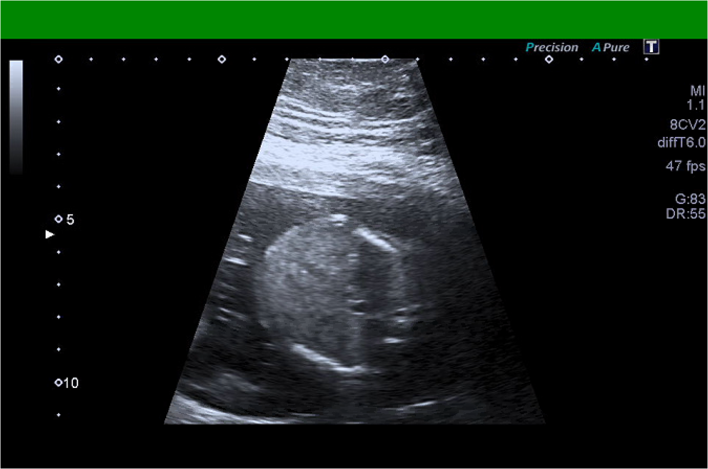

# XNAT Training

Tracked documentation on mandatory XNAT training for all users.

[View Repo](https://github.com/GSTT-CSC/XNAT) . [Report Error](https://github.com/GSTT-CSC/XNAT/issues) . [Request Feature](https://github.com/GSTT-CSC/XNAT/issues) . [Request Document](https://github.com/GSTT-CSC/XNAT/issues)

<!-- TABLE OF CONTENTS -->

  
<h2 style="display: inline-block">Table of Contents</h2>

  <ol>
    <li>
      <a href="#background">Background</a>
      <ul>
        <li><a href="#prerequisites">Prerequisites</a></li>
        <li><a href="#posttraining">Post-training</a></li>
      </ul>
    </li>
    <li>
        <a href="#overview">Overview</a>
        <ul>
          <li><a href="#pii">Personally Identifiable Information (PII) and its importance</a></li>
          <li><a href="#dicom">DICOM (Digital Imaging and Communications in Medicine)</a></li>
          <li><a href="#deidentification">De-identification, anonymisation, and pseudo-anonymisation</a></li>
          <li><a href="#xnat">XNAT in Guy's and St Thomas' NHS Foundation Trust (GSTT)</a></li>
            <ul>
                <li><a href="#useraccess">User access</a></li>
                <li><a href="#dataimport">Data import</a></li>
                <li><a href="#dataprocessing">Data processing post-import</a></li>
                <li><a href="#dataexport">Data export</a></li>
                <li><a href="#tipsandtricks">Tips and tricks</a></li>
            </ul>
        </ul>
    </li>
    <li><a href="#resources">Resources</a></li>
    <li><a href="#contributing">Contributing</a></li>
    <li><a href="#contact">Contact</a></li>
  </ol>

<!-- BACKGROUND -->
<a name="background"><h2>Background</h2></a>

Before individuals are granted access to XNAT, they are required to undergo a mandatory training session, which is delivered by a member of the Clinical Scientific Computing (CSC) team who has XNAT administrator privileges. These sessions are scheduled as and when new user requests are submitted to the CSC team.  

Similar to other GSTT mandatory training, existing XNAT users are also required to periodically retake this training to update their training compliance records (see the CSC Quality Management System (QMS) repository [here](https://github.com/GSTT-CSC/CSC-QMS) for more information).   

<!-- PREREQUISITES -->
<a name="prerequisites"><h3>Prerequisites</h3></a>
GSTT XNAT users must:
- Have a valid GSTT email address
- Have their Information Governance (IG) training up-to-date
- Have ordinary access to the data they will be working with (e.g. PACS access)
- Be able to access the platform whilst connected to the Trust VPN, i.e. either on a Trust computer on-site or via Citrix

<!-- POST-TRAINING -->
<a name="posttraining"><h3>Post-training</h3></a>
Once GSTT XNAT users have undergone the initial training session, they will be provided with a short quiz to test their knowledge. The required pass rate is 80% and users are welcome to both re-submit their answers and reach out to an XNAT administrator for more information and/or further training. Once an XNAT user has acquired a passing mark, the submitted document forms a part of their training log and should be kept for future reference.

Additionally, an XNAT administrator will then:
- Create their XNAT user account and temporary password
- Provide their GSTT XNAT account username, password, project scope, i.e. which projects they have access to, and a link to GitHub XNAT repository via email

<!-- OVERVIEW -->
<a name="overview"><h2>Overview</h2></a>
The training session covers a high-level overview of XNAT, data that can be imported, processed, and exported, data governance, and recommended best practices. The training session is delivered virtually over Microsoft Teams, and usually takes around 30 minutes to complete a walkthrough of the following concepts.

<!-- PII -->
<a name="pii"><h3>Personally Identifiable Information (PII) and its importance</h3></a>
Personally identifiable information (PII) is information personal to an individual and enables the identification (or re-identification) of that individual. PII in healthcare includes directly identifiable information such as name and address of the patient, as well as indirectly identifiable information such as the time and place of an appointment, imaging session labels, names of referrers and so on.

We recommend referring to NHS Digital's resources [here](https://digital.nhs.uk/services/national-data-opt-out/understanding-the-national-data-opt-out/confidential-patient-information) and [here](https://digital.nhs.uk/services/national-data-opt-out/operational-policy-guidance-document/appendix-6-confidential-patient-information-cpi-definition) for more information, but given the importance of PII and the potential negative impact when inappropriately used, XNAT users are required to bear this in mind and adhere to best practices, e.g. de-identification, data transfer/sharing, etc., throughout their use of routinely acquired medical data.

This is includes:
- Using de-identification, anonymisation, and/or pseudo-anonymisation scripts in XNAT or as part of data processing post-import if required, e.g. as part of project approvals
- Ensuring patients who have opted out of use of their data for secondary purposes, i.e. indirect care such as research or training artificial intelligence (AI) algorithms, are excluded from all projects
- Storing and transferring data exported from XNAT on secure devices and via secure transfer protocols approved by the Trust 

<!-- DICOM -->
<a name="dicom"><h3>DICOM (Digital Imaging and Communications in Medicine)</h3></a>
DICOM (Digital Imaging and Communications in Medicine) is an international standard format for medical imaging data storage, retrieval, processing and transfer. DICOM images consist of the actual acquired image as a set of pixels and a DICOM header. Data coded within the DICOM header are a series of attributes describing the scan and patient. Each attribute is tagged with a unique DICOM tag which consists of a group and element number, and each tag has a name to identify the type of information (or attribute) contained within the tag. This principle of data tagging allows DICOMs to be compared, transferred, stored and queried.

<!-- DEIDENTIFICATION -->
<a name="deidentification"><h3>De-identification, anonymisation, and pseudo-anonymisation</h3></a>
Before any medical data can be used in projects for secondary purposes, i.e. indirect care such as research or training AI algorithms, it must first be **completely de-identified/anonymised such that no data used can be traced back to any individual**. To do this, the DICOM tags need to be altered, deleted or manipulated in such a way that the image cannot be used to identify the individual. 

However, because (1) there are many DICOM tags within a DICOM header and (2) it is not always straightforward to determine what is and is not identifiable information, [DICOM Standards Supplement 142](https://www.dicomstandard.org/News-dir/ftsup/docs/sups/sup142.pdf) was created. This outlines best de-identification practices for purposes of clinical trials, and we have adopted this same standard for our de-identification approach (see [here](https://github.com/GSTT-CSC/XNAT/tree/main/docs#anonymisation) for more information).

<!-- XNAT -->
<a name="xnat"><h3>XNAT in Guy's and St Thomas' NHS Foundation Trust (GSTT)</h3></a>
XNAT is a picture archiving platform (a PACS system) capable of storing and managing medical images and associated data. Within GSTT, it forms a part of the local secure enclave for the purpose of federated learning in AI projects. The data is extracted from clinical PACS systems into XNAT where it is anonymised and sorted into relevant projects, ensuring data is only visible to those who are authorised to see it, and allowing for data deletion upon project completion.

<!-- USER ACCESS -->
<a name="useraccess"><h4>User access</h4></a>
> ⚠️ Remember: To access GSTT's XNAT, users must be (1) connected to the Trust VPN either via a Trust computer on-site or via Citrix and (2) have a valid XNAT user account. 

- Users should open Google Chrome (preferred browser as it doesn't work well on Internet Explorer, Edge, etc.), and navigate to https://sp-pr-flipml01.gstt.local
- They can then navigate to the project(s) they have access to by clicking on _Browse > My Projects_ in the top-hand navigation bar
  - If the project does not exist yet, please contact [Dika](mailto:Dijana.Vilic@gstt.nhs.uk) and/or [Haleema](mailto:Haleema.AlJazzaf@gstt.nhs.uk) to create it

From the project's main page, users can:
 - View live progress of data ingestion by clicking on _View Prearchive_ in the right-hand sidebar 
 - Ingest a small dataset, i.e. less than or equal to 100 studies, via the Data Query Retrieve (DQR) route by clicking on _Import From PACS_ in the right-hand sidebar
   - This will open a page wherein users can [query Sectra PACS based on search criteria](https://github.com/GSTT-CSC/XNAT/tree/main/docs#entering-the-search-criteria), or [import a CSV file of studies to be ingested](https://github.com/GSTT-CSC/XNAT/tree/main/docs#importing-a-csv-file) 
   - If you have a larger dataset to upload, we recommend using the XNAT REST API. Please reach out to [Dika](mailto:Dijana.Vilic@gstt.nhs.uk) and/or [Haleema](mailto:Haleema.AlJazzaf@gstt.nhs.uk) for more information on this process as it is only available with administration rights
 - View subjects successfully ingested into the XNAT project at the bottom of the project's main page under _Subjects_

<!-- DATA IMPORT -->
<a name="dataimport"><h4>Data import</h4></a>
There are several methods to import data from a PACS into XNAT, which are detailed [here](https://github.com/GSTT-CSC/XNAT/blob/main/docs/SOP-Data-Import.md) and include:
- Data query retrieve (DQR) using a CSV (limited to simple data in limited amounts)
- REST API (limited to around 50-100 imaging sessions at a time)
- Scripting (limitless but only available with headnode access and advanced training)
           
<!-- DATA PROCESSING POST-IMPORT -->
<a name="dataprocessing"><h4>Data processing during/post-import</h4></a>
Data processing during/post-import includes:
- De-identification/anonymisation per DICOM tags in XNAT happens on data import (see example [here](https://github.com/GSTT-CSC/XNAT/blob/main/xnat-csc/helpers/Project-specific%20anon%20script.txt))
- Face masking, i.e. obfuscate personally identifiable facial features in high-definition MRI head images post-import   

- De-identification of ultrasounds, i.e. obfuscate burnt-in data post-import outside of XNAT with [`deid`](https://pydicom.github.io/deid/getting-started/dicom-pixels/) (see example [here](https://github.com/GSTT-CSC/XNAT/blob/main/xnat-csc/scripts/pixelcleaning.py))   

You can view, annotate or contour images within XNAT platform itself using [XNAT Open Health Imaging Foundation (OHIF) Viewer](https://wiki.xnat.org/documentation/xnat-ohif-viewer/using-the-xnat-ohif-viewer-122978515.html).
<!-- DATA EXPORT -->
<a name="dataexport"><h4>Data export</h4></a>
There are several ways to download data from XNAT, such as downloading:
- Directly - one image at a time from Experiment level 
- In bulk - project-wide by clicking on 'download images' on the right-hand side of project landing page (limited by size)
- Via the server backend - you need to have root privileges on the headnode for this - speak to XNAT administrators if you need this type of data export (not limited)

<!-- TIPS AND TRICKS -->
<a name="tipsandtricks"><h4>Tips and tricks</h4></a>
Due to the IT security restraints on third-party application installation on Trust environments, there are some DICOM viewers well-suited to view DICOMs exported from XNAT as they do not require installation, e.g. [MicroDICOM](https://www.microdicom.com/) and [ImageJ](https://imagej.net/).

<!-- RESOURCES -->
<a name="resources"><h2>Resources</h2></a>
* [XNAT](https://www.xnat.org/)
* [DICOM Standards Supplements](https://www.dicomstandard.org/supplements)

<!-- CONTRIBUTING -->
<a name="contributing"><h2>Contributing</h2></a>
- Fork or clone the Project
- Create your new feature, bug fix, etc. branch, i.e. `git checkout -b feature/AmazingFeature` or `git checkout -b bug/BugFix`
  - If you are creating a branch to resolve an existing [Issue](https://github.com/GSTT-CSC/XNAT/issues), we recommend creating your branch linked to that issue, i.e. open the Issue on your web browser and select _**Create a branch for this issue or link a pull request**_ under the **Development** section in the right-hand sidebar:
   
- Commit your changes, i.e. `git commit -m 'Add some AmazingFeature'`
- Push to the remote, i.e. `git push origin feature/AmazingFeature`
- Open a Pull Request (PR) and specify that you want to merge your branch into the `main` branch

<!-- CONTACT -->
<a name="contact"><h2>Contact</h2></a>
* [Dika Vilic](mailto:Dijana.Vilic@gstt.nhs.uk) ([GSTT-CSC](https://gstt-csc.github.io/))
* [Haleema Al Jazzaf](mailto:Haleema.AlJazzaf@gstt.nhs.uk) ([GSTT-CSC](https://gstt-csc.github.io/))
* [CSC Team](mailto:CSCTeam@gstt.nhs.uk)

<!-- ACKNOWLEDGEMENTS -->
<a name="acknowledgements"><h2>Acknowledgements</h2></a>
* [README template by othneildrew](https://github.com/othneildrew/Best-README-Template)
* [Neuroinformatics Research Group at Washington University](https://www.mir.wustl.edu/research/research-centers/computational-imaging-research-center-circ/labs/marcus-lab)
